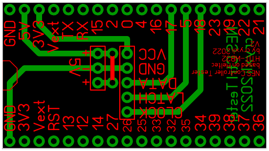
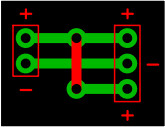
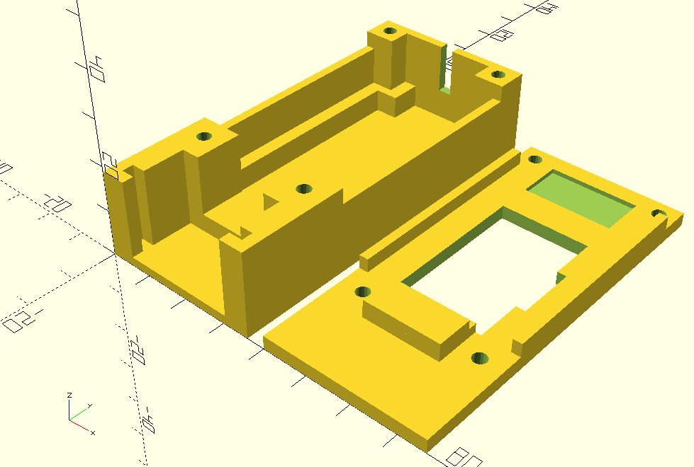
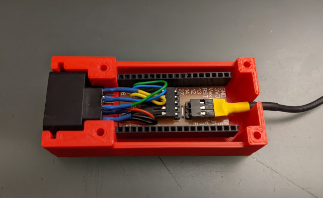
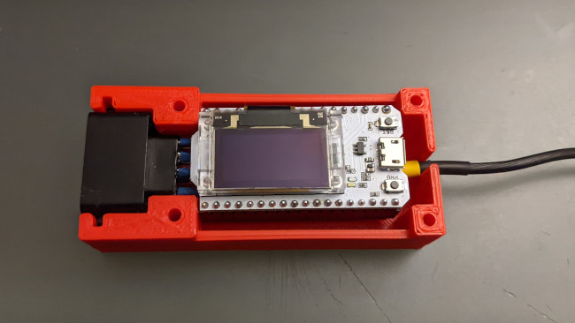

# NES Controller Tester

 > When fixing and refurbishing S/NES controllers, I need a way to quickly test the buttons. Games are usually not that useful, since you have to start something before you can test all buttons. To save me fiddling with potentially buggy consoles, I desinged my own tester.
>
> ~ cryxli, August 2022

TODO add image of finished project working

## Project Overview

You do not have to go the extra mile to make the project modular. By doing so you save on Dupont headers, but have to scope with an increased risk of damaging the ESP.

### Repository

- ``/doc`` - Contains files for the documentation.
- ``/NES_controller_tester`` - Contains the [Arduino](https://www.arduino.cc) source code. Open this folder in the IDE.
- ``/pcb`` - Contains the [Sprint Layout 6](https://www.electronic-software-shop.com/lng/en/electronic-software/sprint-layout-60.html?language=en) design of the base plate.
- ``/scad`` - Contains the [OpenSCAD](https://openscad.org) design for the enclosure.

### Parts

- NES controller socket with straight pins
- [Heltec Wifi Kit 32, with OLED display](https://heltec-automation-docs.readthedocs.io/en/latest/esp32/quick_start.html)
- Straight and angled pin headers and sockets
- 5 pin Dupont connector
- 3 pin Dupont connector
- Dupont female crimps
- USB lead

### Tools

- Soldering equipment (iron, solder, flux)
- Pliers for Dupont crimps
- Computer with [Arduino](https://www.arduino.cc) IDE to flash the ESP
- NES controller and UBS power bank for testing

## S/NES Controller Pinout

NES and SNES controllers work exactly the same. Because both are keyed (they are asymmetrical) there is no need to distingush between front or back, socket or connector view.

- ``RED`` := 5V
- ``GRAY`` := GND
- ``BLUE`` := Clock (active low)
- ``ORANGE`` := Latch (active high)
- ``YELLOW`` := Data (active low)
- ``WHITE`` := unused by standard controllers

"Active low" means a locigal ``1`` is represented by 0V. While with "active high" a logical ``1`` would be represented by about 3V or above.

## Protocol

The S/NES controllers use a serial protocol to transmit the state of the buttons to the console. That means a [Shift Register (PISO)](https://en.wikipedia.org/wiki/Shift_register#Parallel-in_serial-out_(PISO)) reads the state of the buttons and then sends them one by one over the DATA line to the console.

For that to happen the console must tell the controller to read the button states by setting LATCH high.

With every pulse of the CLOCK to low the next button state is set on the DATA line.

A button is pressed <=> Corresponding DATA is low.

## Shift Registers

The NES controllers have only one 8-bit shift register for their 8 buttons. The SNES controllers have 12 buttons and use two 8-bit shift registers chained together. 

The order in which the button states are transmitted differs

| Controller | T1  | T2  | T3     | T4    | T5  | T6   | T7   | T8    | T9  | T10 | T11 | T12 |
|:-----------|:---:|:---:|:------:|:-----:|:---:|:----:|:----:|:-----:|:---:|:---:|:---:|:---:|
| NES        | A   | B   | Select | Start | Up  | Down | Left | Right | -   | -   | -   | -   |
| SNES       | B   | Y   | Select | Start | Up  | Down | Left | Right | A   | X   | L   | R   |

[Shift registers](https://en.wikipedia.org/wiki/Shift_register) don't care how many times they are pulsed (CLOCK) to send the next bit. As long as they have data, they will answer before they eventually default to zeros.

Therefore, it should be possible to read both types of controller with the same piece of code that asks them for 16 bits of data.

## Display

[ESP8266](https://www.espressif.com/en/products/socs/esp8266) and later ESPs are overkill for reading S/NES controllers, but they constantly evolve. [Heltec Automation](https://heltec.org/) resently created a Devkit combined with an 128x64 pixel OLED display.

They provide full support for the [Arduino](https://www.arduino.cc) development environment. Including a library to address the OLED display, complete with examples.

:bulb: [Setup Heltec ESP32 LoRa](https://heltec-automation-docs.readthedocs.io/en/latest/esp32/quick_start.html)

## Assembly

Most ESPs don't like it when you apply more than 3.3V on their input pins. To avoid that the controllers do that, let's drive them with only 3.3V from the board's voltage regulator.

The colored pins correspond to the colors used in the controller pinout, above. 

- ``GREEN`` = ``5V`` := Vin input voltage
- ``GRAY`` = ``GND`` := Ground or 0V reference for input voltage and connector circuit
- ``BLUE`` = ``18`` := Clock
- ``ORANGE`` = ``5`` := Latch
- ``YELLOW`` = ``17`` := Data
- ``RED`` = ``3V3`` := regulated 3.3V

The pins on the ESP board are not numbered like the legs of an IC. Look at a [pinout diagram](https://resource.heltec.cn/download/WiFi_Kit_32/WIFI_Kit_32_pinoutDiagram_V2.pdf) or the PCB, below.

## PCB

Note the gound pin next to the 5V input pin... I fried a board applying 5V using that pin as the 0V reference. To avoid future accidents I've drawn a base PCB in [Sprint Layout 6](https://www.electronic-software-shop.com/lng/en/electronic-software/sprint-layout-60.html?language=en). There is a free viewer on their site, too.

I also turned the design 180° to match the layout of the images above.

The idea is to have a 90° pin header expose the 5 connections for the controller and a 3 pin header for the power supply.

### 5V via USB

Whenever I cut off a USB lead and turn it into a 5V power supply for my projects, I add a 3 pin Dupond connector with center negative. By adding a link between the outer pins on the project/board, I do not have to worry about polarity anymore. 

This comes from a time when I only used [Dupont](https://www.google.com/search?q=Dupont+connector) connectors that were *not* keyed.

## Enclosure

For the NES socket to fit in the 3d printed box, we have to cut off its studs at the bottom.

The design will hold it in place with the side tags only.

I use [OpenSCAD](https://openscad.org). Not only is it free, it also suits my way of designing best.

The lid is designed to register with the body. There should be less than 1/2 mm play with every component.

The box has holes for M3 bolts to hold it closed, but the friction fit of the interlocking lid is usually enough.

Pay extra attention to the OLED display when closing the lid! The top glass layer is very thin and breaks easily. 

# Resources

Some helpful links:

- [Wifi Kit 32](https://heltec.org/project/wifi-kit-32/)
  - [Pinout](https://resource.heltec.cn/download/WiFi_Kit_32/WIFI_Kit_32_pinoutDiagram_V2.pdf)
- [Sprint Layout 6](https://www.electronic-software-shop.com/lng/en/electronic-software/sprint-layout-60.html?language=en)
  - [Viewer](https://www.electronic-software-shop.com/support/kostenlose-datei-viewer/)
- [OpenSCAD](https://openscad.org)
  - [User Manual](https://en.wikibooks.org/wiki/OpenSCAD_User_Manual)
